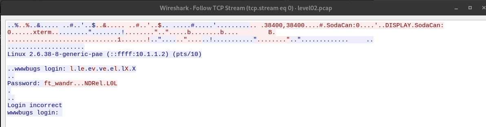

## Level 02:


Il y a un fichier level02.pcap

Ces fichiers sont a ouvrir avec wireshark, ici le fichier une fois ouvert on peut utiliser l'option ```FOLLOW--> TCP Stream``` et on obtient un mot de passe partiel : 


si on regarde les transferts qui correspondent au ```.``` on peut voir que ca corresponds au transfere d'un packet de 1 byte : 7f 


en ascii 7f correspond a DEL

le mot de passe est donc : 
```ft_waNDReL0L```
